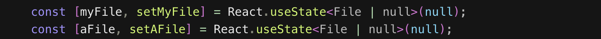
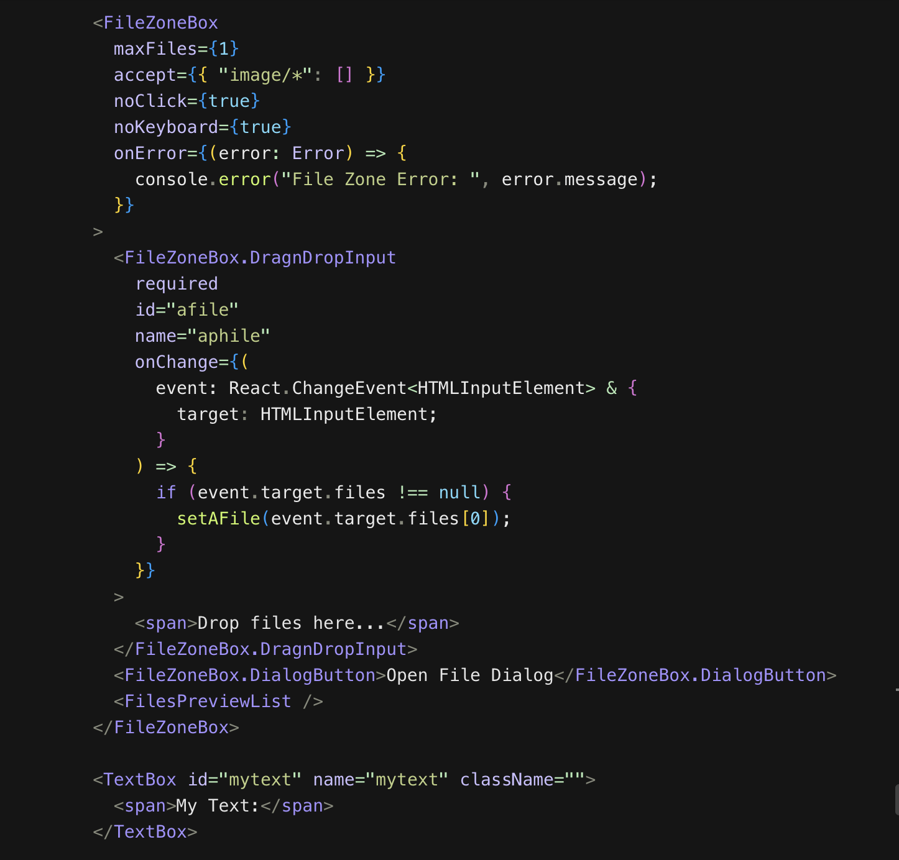
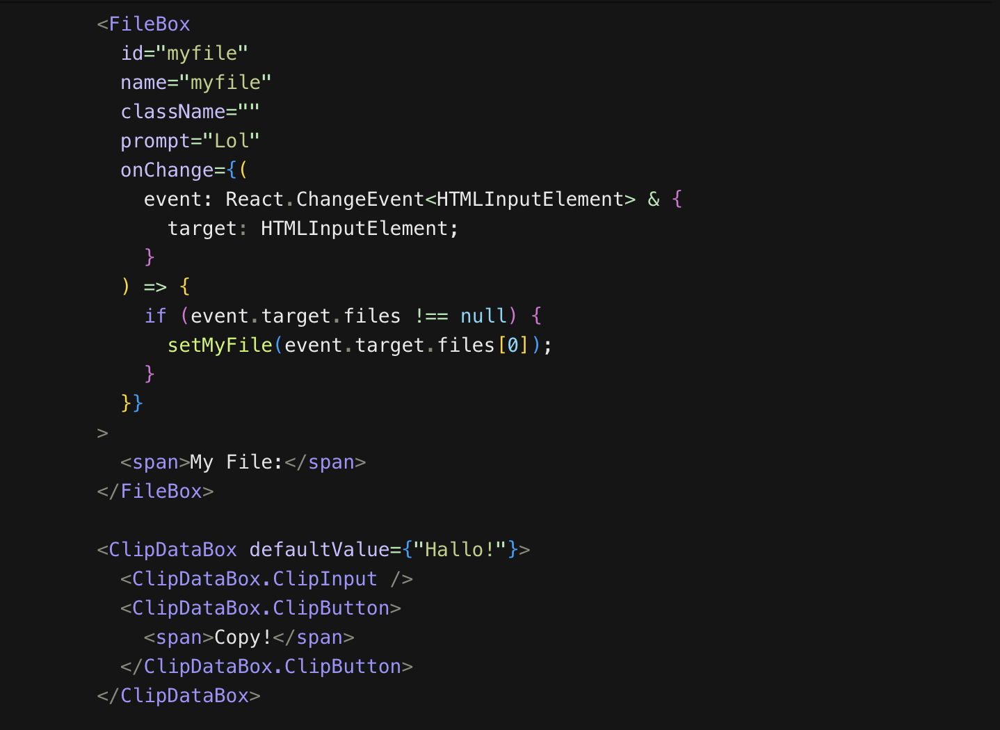
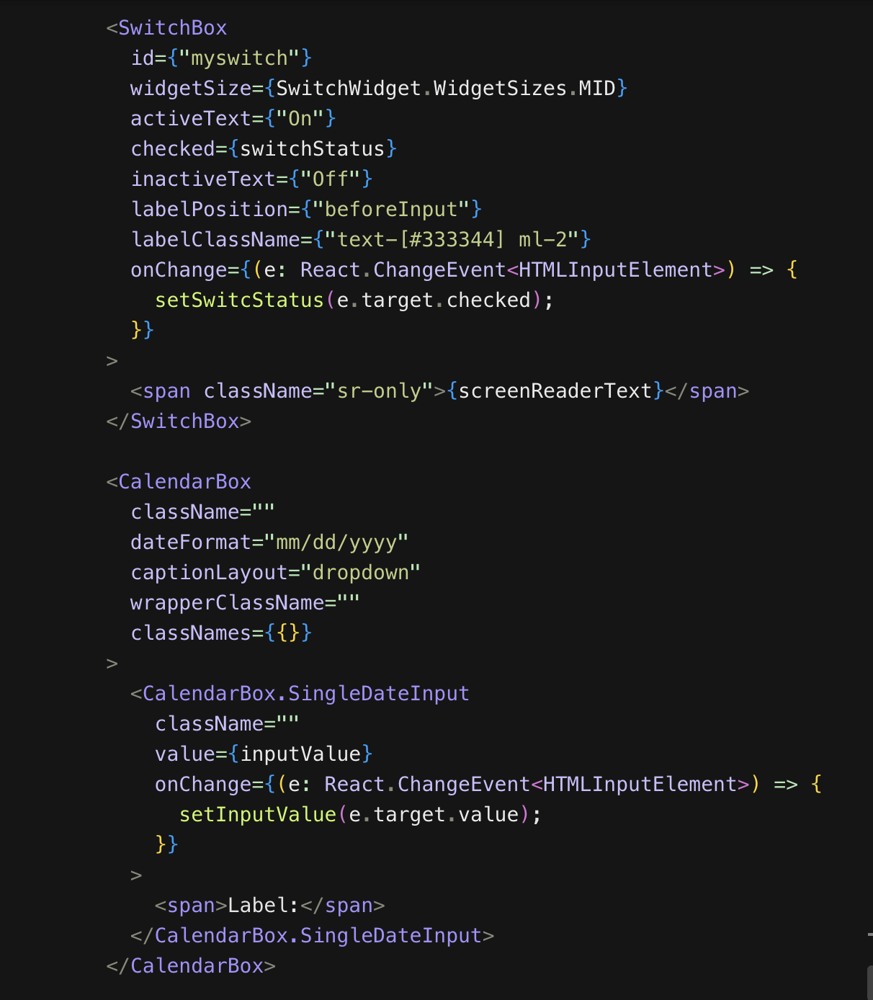

 

# react-busser-headless-ui
A progressive, unstyled, accessible, atomic, highly reusable, flexible and configurable headless UI component library for ReactJS.

>**HIGHLIGHTS**

_We all deserve a UI library that allows us to ship minimal CSS to devices, demands minimal boilerplate to create simple and complex components, deploys flexible theming options and doesn't lock us into a particular CSS framework (e.g. **Tailwind**, **Bulma**, **Bootstrap**)._

_Finally, a UI library that ties UI components to routers (e.g. app/page **NextJS_Router**, **Tanstack_Router**, **React_Router**) to ensure more cohesive functionality and behavior especially for components like **&lt;Tabs&sol;&gt;** and **&lt;Modals&sol;&gt;**._

Therefore, **react-busser-headless-ui**:

- Ships with zero styles (Paint on a blank canvas - no colors and no shadows except the ones you define)
- Uses modern [HTML](https://en.wikipedia.org/wiki/HTML5) tags for component structure where necessary (e.g. **&lt;details&gt;**, **&lt;summary&gt;**, **&lt;dialog&gt;** and **&lt;menu&gt;**)
- Minimizes the use of `useState(...)` especially for things [CSS](https://en.wikipedia.org/wiki/CSS3_(disambiguation)#:~:text=CSS3%20is%20an%20abbreviation%20for,stylesheet%20language%20for%20structured%20documents.) can already handle. (e.g. toggling the visibility of a DOM node or capturing invalid state)
- Reduces boilerplate associated with setting up a component especially around structure, testability and reusability.
- Also, makes use of the very best third-party libraries to handle forms, toasts, utilities and state management (i.e. [**react-hook-form**](https://react-hook-form.com/docs), [**react-busser**](https://github.com/codesplinta/busser/blob/main/README.md), [**react-day-picker**](https://daypicker.dev/), [**react-dropzone**](https://react-dropzone.js.org/#src) & [**sonner**](https://sonner.emilkowal.ski/getting-started)

## Preamble

There are lots of headdless UI libraries out there (e.g. [**Material UI**](https://mui.com/), [**Radix UI**](https://www.radix-ui.com/) e.t.c). While many of these UI libraries give you the flexibility and atomicity to build what you want in a fairly easy manner, they don't give you a lot of options for configuration. Sometimes, all you have [a set of strict primitives](https://www.radix-ui.com/primitives) that lock you into a specific pattern for building your components on an atomic level or [bloated themeing configurations](https://mui.com/material-ui/customization/theme-components/) whose styling defaults aren't helpful to you in relation to your custom design system for UI widgets/components. Furthermore, `useState()` is over used for things that [CSS](https://en.wikipedia.org/wiki/CSS3_(disambiguation)#:~:text=CSS3%20is%20an%20abbreviation%20for,stylesheet%20language%20for%20structured%20documents.) can do already. **react-busser-headless-ui** steps into these gaps with superior rendering performance and optimized state management.

One of the reasons i started this project is that i kept waiting for [**Radix UI**](https://www.radix-ui.com/) to support [**DatePicker primitives** but till date it doesn't](https://github.com/radix-ui/primitives/discussions/969).

This project is also inspired (in part) by [**Base UI**](https://github.com/mui/base-ui) which is a collaborative effort from the team members of the [**Material UI**](https://mui.com/) and [**Radix UI**](https://www.radix-ui.com/) projects. However, still fundamentally different.

## Getting Started
