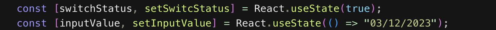
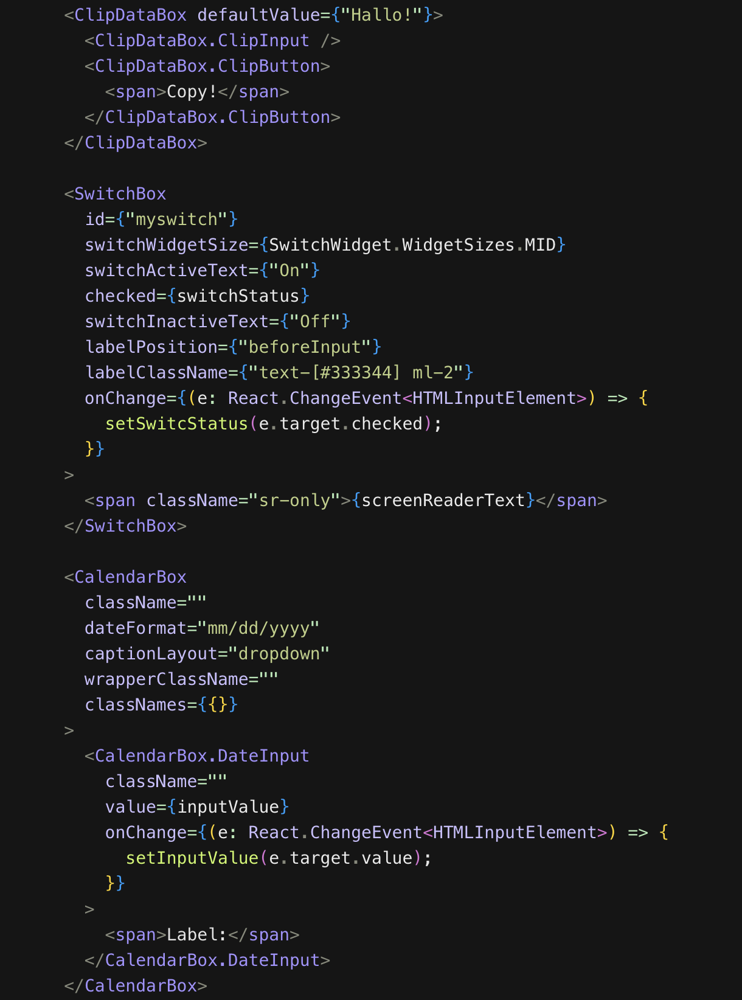

# react-busser-headless-ui (WIP)
A progressive, atomic, highly reusable, flexible and configurable headless UI component library for ReactJS.

>**HIGHLIGHTS**

- Ships with zero styles (Paint on a blank canvas - no colors, background-colors or shadows except the ones you define)
- Uses modern [HTML](https://en.wikipedia.org/wiki/HTML5) tags for component structure where necessary (e.g. **details**, **summary**, **dialog** and **menu**)
- Minimizes the `useState()` especially for things [CSS](https://en.wikipedia.org/wiki/CSS3_(disambiguation)#:~:text=CSS3%20is%20an%20abbreviation%20for,stylesheet%20language%20for%20structured%20documents.) can already handle. (e.g. toggling the visibility of a DOM node or capturing invalid state)
- Reduces boilerplate associated with setting up a component especially around
- makes use of the very  best third-party libraries to handle forms, utility and state management (i.e. [react-hook-form](https://react-hook-form.com/docs), [react-busser](https://github.com/codesplinta/busser/blob/main/README.md) & [react-day-picker](https://daypicker.dev/)

## Preamble

There are lots of headdless UI libraries out there (e.g. [Material UI](https://mui.com/), [Radix UI](https://www.radix-ui.com/) e.t.c). However, none of them give you the flexibility and atomicity to build what you want in a fairly easy manner. Also, `useState()` is over used for things that [CSS](https://en.wikipedia.org/wiki/CSS3_(disambiguation)#:~:text=CSS3%20is%20an%20abbreviation%20for,stylesheet%20language%20for%20structured%20documents.) can do already. **react-busser-headless-ui** steps in the gap with superior rendering performance and optimized state management.
